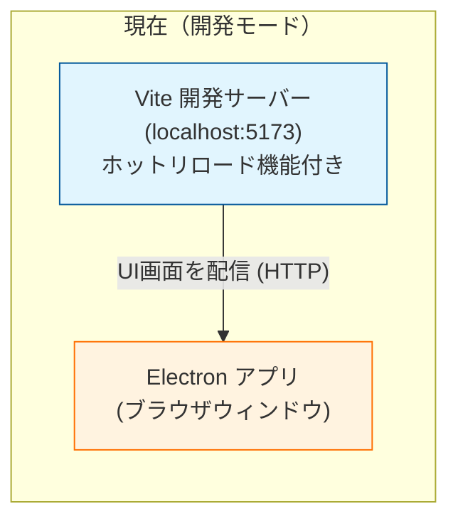
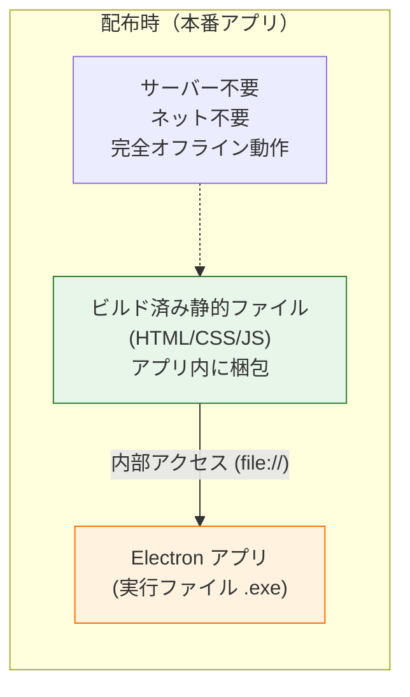

# Volumix 技術アーキテクチャ

このドキュメントでは、Volumixアプリがどのように動作しているか、特に「開発中」と「配布用（本番）」でのサーバーの扱いの違いについて解説します。

## アーキテクチャ図

### 1. 開発モード (Development)
現在動かしている状態です。変更を即座に反映させるために、ローカルサーバーが裏で動いています。

### 2. 配布用アプリ (Production)
ユーザーに配布する際（ビルド後）の状態です。**サーバーは消滅**し、アプリ単体で完結します。

## 解説

- **開発サーバー (Vite)**: 開発中のみ使用します。コードを保存するたびに自動で画面を更新してくれる便利なツールですが、完成したアプリには含めません。
- **ビルド (Build)**: 開発サーバーで動いていた内容を、サーバーなしで動く「ただのファイル（HTML/CSS/JS）」に変換する作業です。
- **配布**: 完成した `.exe` ファイルの中には、この変換されたファイルがすべて埋め込まれています。そのため、ユーザーのPCでサーバーを立てる必要はありません。
