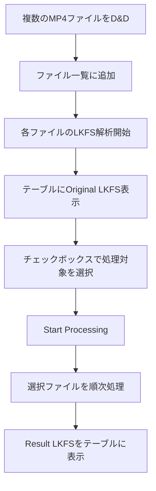

# 複数ファイル対応機能 - 実装完了レポート

Volumixアプリに複数MP4ファイルの一括処理機能を追加しました。

## 変更したファイル

### フロントエンド

#### [App.jsx](file:///c:/Users/sts3886/Documents/dev/volumix/src/App.jsx)
- 単一ファイル管理から複数ファイル配列管理に変更
- `FileTable`コンポーネントを統合
- 一括解析・変換処理のロジックを実装

#### [FileDropper.jsx](file:///c:/Users/sts3886/Documents/dev/volumix/src/components/FileDropper.jsx)
- 複数ファイルのドラッグ&ドロップに対応
- `onFilesSelected`コールバックでファイル配列を返す

#### [FileTable.jsx](file:///c:/Users/sts3886/Documents/dev/volumix/src/components/FileTable.jsx)（前回作成済み）
- ファイル一覧をテーブル表示
- チェックボックスで処理対象を選択
- Original/Result LKFSとステータスを表示

### バックエンド

#### [main.cjs](file:///c:/Users/sts3886/Documents/dev/volumix/electron/main.cjs)
- `select-files`ハンドラを追加（複数ファイル選択対応）

#### [preload.cjs](file:///c:/Users/sts3886/Documents/dev/volumix/electron/preload.cjs)
- `selectFiles` APIを追加

---

## UIスクリーンショット

---

## 動作フロー

---

## 今後の手動テスト

1. 複数のMP4ファイルをドラッグ&ドロップして追加されることを確認
2. 各ファイルのOriginal LKFSがテーブルに表示されることを確認
3. チェックボックスで選択/解除できることを確認
4. Start Processingで選択ファイルのみ処理されることを確認
5. 処理後のResult LKFSが表示されることを確認
